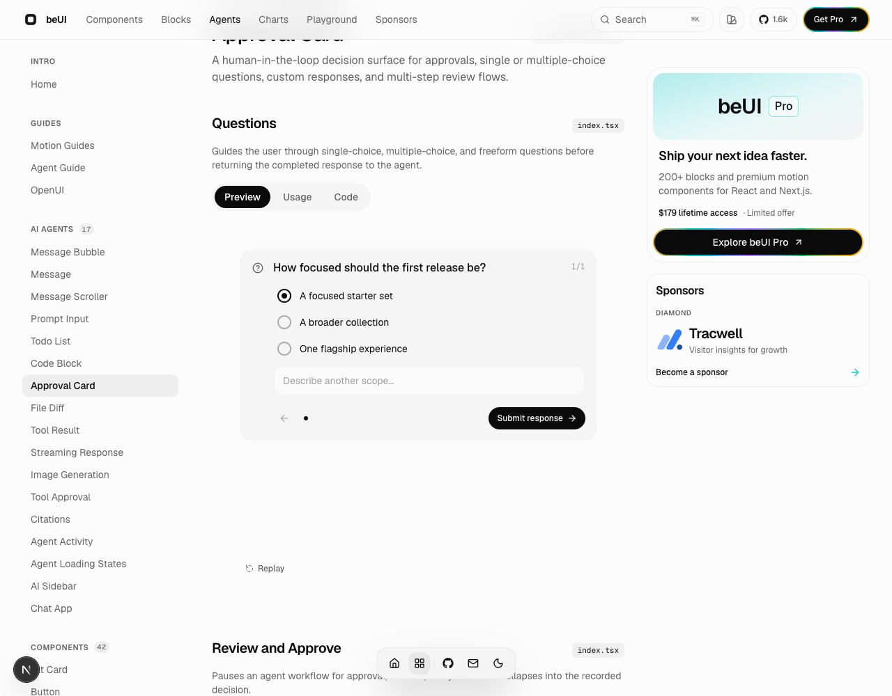
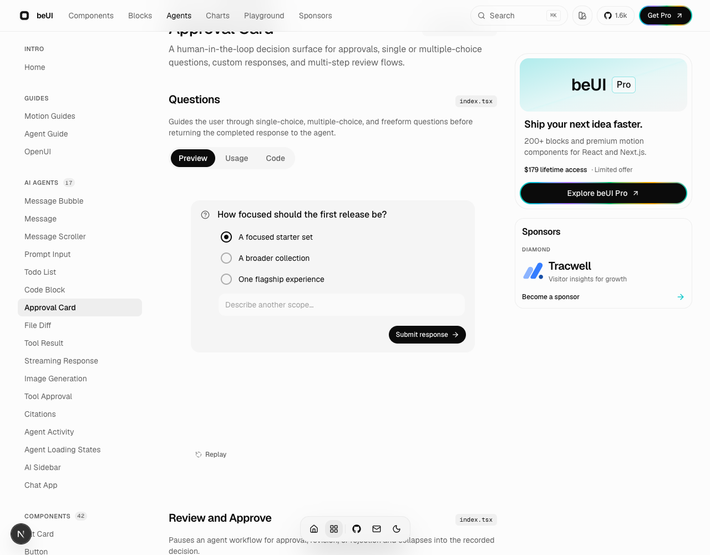
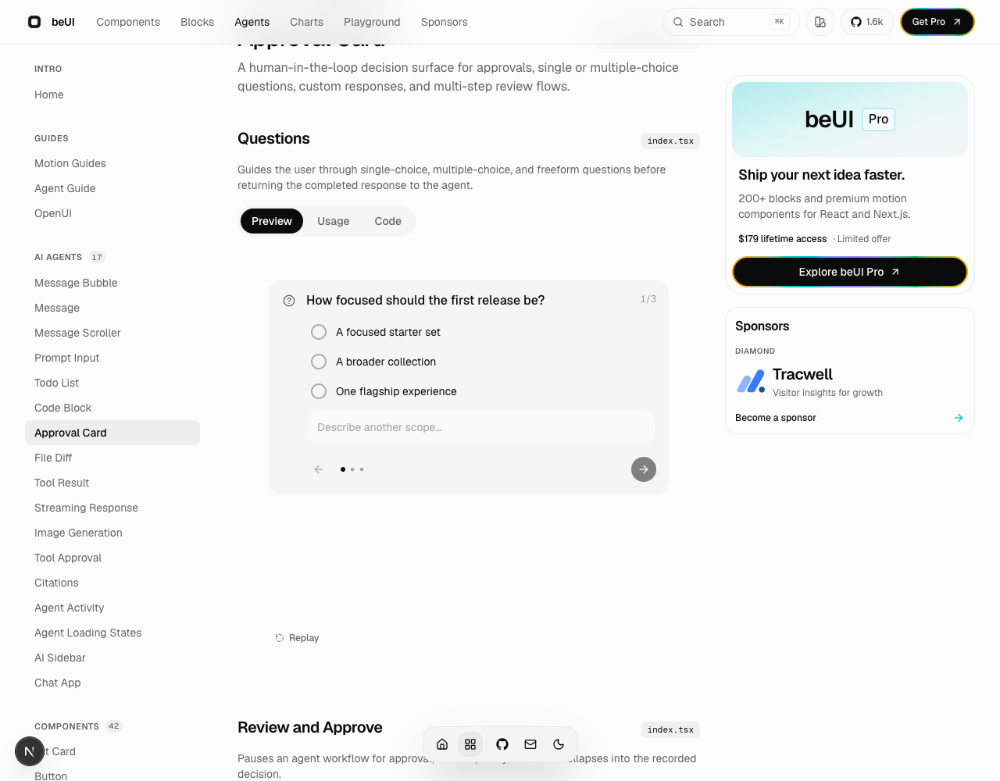

# ApprovalCard single-question navigation evidence

Captured with agent-browser (Chromium, light theme, 1280 × 1000) from the upstream docs demo at `/components/agents/approval-card`.

- Before: upstream main `0809f3fb99d4d2a87d4ceab6362c761065e744c4`.
- After: fix `fad3a1e`.
- Single-question reproduction: temporarily pass `QUESTIONS.slice(0, 1)` in `components/previews/agents/approval-card-question.preview.tsx`, select “A focused starter set”, and capture the viewport. The baseline uses the unchanged upstream component. These temporary demo changes were restored before committing the fix.
- Multi-question verification uses the original three-question demo. Keyboard Space activates a radio and auto-advances; previous navigation preserves its selection; next navigation and final custom-answer keyboard submission reach the answered state.

All content is generic upstream demo data.

| Before (single) | After (single) |
| --- | --- |
|  |  |

